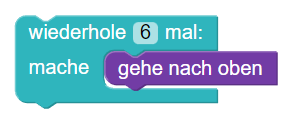
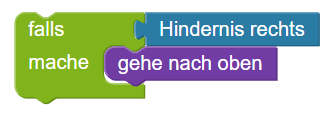
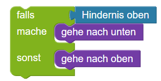
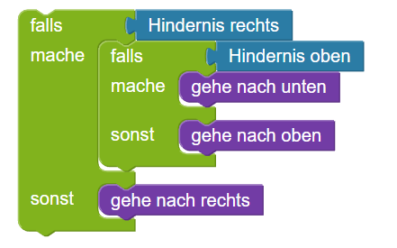
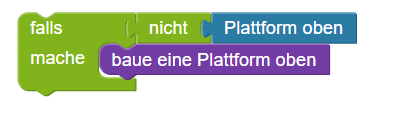
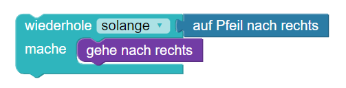
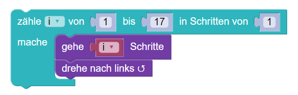
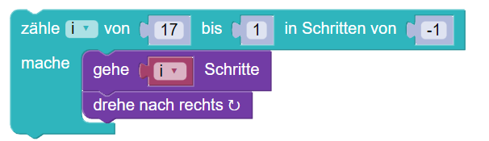

### Blockly - Python

---



```
for i in range(6):
    oben()
```
---



```
if hindernisRechts():
    oben()
```

---


```
if hindernisOben():
    unten()
else:
    oben()
```

---


```
if hindernisRechts():
    if hindernisOben():
        unten()
    else:
        oben()
else:
    rechts()
```

---


```
if not plattformOben():
    bauePlattformOben()
```

---


```
while aufPfeilNachRechts():
    rechts()
```

---


```
for i in range(1,18):
    geheSchritte(i)
    links()
```

---


```
for i in range(17,0,-1):
    geheSchritte(i)
    rechts()
```
---
