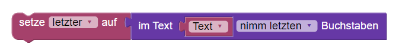
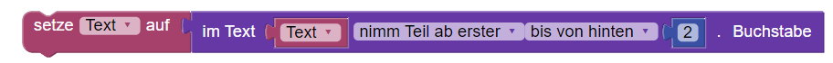
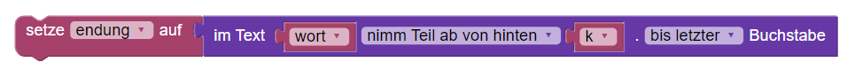
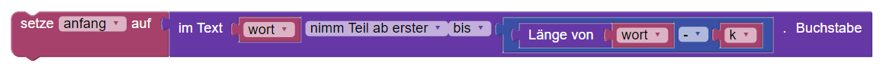
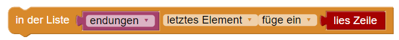
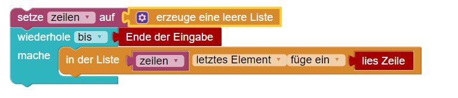
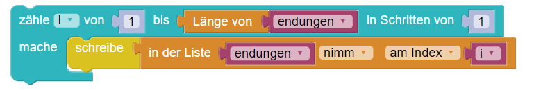

### Von Blockly nach Python  

#### Text


---

Den letzten Buchstaben in eine Variable speichern:



```
letzter = text[-1]
```

----

Den letzten Buchstaben in einem Text entfernen



```
text = text[:-1]
```

----

Die letzten k Buchstaben des Texts ```wort``` in eine Variable ```endung``` speichern.



```
endung = wort[-k:]

```

---

Die Variable ```anfang``` auf  ```wort``` ohne die letzten k Zeichen setzen.



```
anfang = wort[:-k]

```

----

#### Listen

Am Ende einer Liste etwas hinzufügen



```
endungen.append(zeile)

```

---- 

Eine typische Schleife zum Einlesen von Daten in eine Liste ```zeilen```.



---


Die Liste ```endungen``` durchlaufen und den Inhalt zeilenweise ausgeben



---


