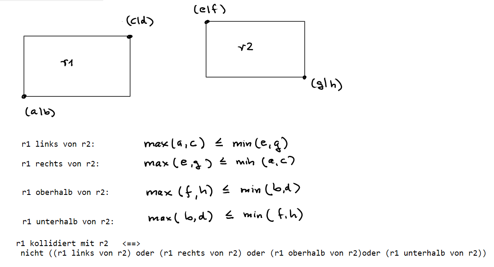

## Landnahme

34\. Bundeswettbewerb Informatik - Junioraufgabe 1

[Aufgabenstellung](./landnahme.pdf) - 
[Lösungshinweise](./landnahme_loesungshinweise.pdf)


#### Pseudocode

```
r0 = erstes Rechteck
print(r0 genehmigt)
 
speichere r0 in der Liste "genehmigt" der genehmigten Rechtecke 
 
für jedes weitere Rechteck r:
    setze r vorläufig auf genehmigt
    für jedes Rechteck rx in der Liste "genehmigt":
        falls r mit rx kollidiert:
            setze r auf abgelehnt
            print(r abgelehnt)
    falls r genehmigt:
        print(r genehmigt)
        füge r in die Liste "genehmigt" ein

```


#### Kollision von zwei Rechtecken

Ein Rechteck r1 kollidiert mit einem Rechteck r2, wenn es weder links noch rechts noch oberhalb noch unterhalb von ihm ist.




#### Python 

``` 
def kollision(a,b,c,d,e,f,g,h):
    '''
    (a,b), (c,d) Koordinaten des 1. Rechtecks
    (e,f), (g,h) Koordinaten des 2. Rechtecks
    
    returns True, wenn das 1.Rechteck weder links noch rechts noch oberhalb noch
       unterhalb des 2. Rechtecks liegt. Dann liegt eine Kollision vor.
    '''
    links = max(a,c) <= min(e,g)
    rechts = max(e,g) <= min(a,c)
    oberhalb = max(f,h) <= min(b,d)
    unterhalb = max(b,d) <= min(f,h)
    return not (links or rechts or oberhalb or unterhalb)

genehmigt = []

f = open('eingabe1.txt')     
r0 = [int(x) for x in f.readline().split()]       # Die erste Zeile lesen
genehmigt.append(r0)
print(*r0, "genehmigt")

zeile = f.readline()                              # Die nächste Zeile lesen
while (zeile):                                    # Solange in der Zeile noch was steht
    r = [int(x) for x in zeile.split()]
    entscheidung = "genehmigt"
    for r1 in genehmigt:
        if kollision(r[0],r[1],r[2],r[3],r1[0],r1[1],r1[2],r1[3]):
            entscheidung = "abgelehnt"
            break
    print(*r,entscheidung)
    if (entscheidung == "genehmigt"):
        genehmigt.append(r)
        
    zeile = f.readline()                          # die nächste Zeile lesen

f.close()
```
