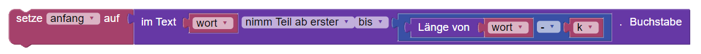
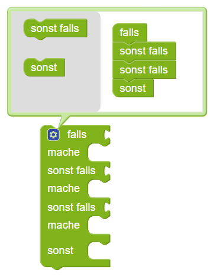
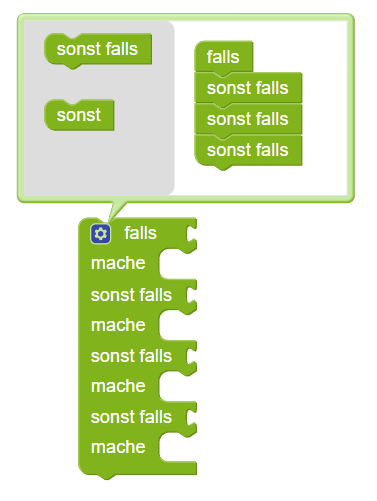
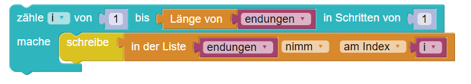

## Muster für Blockly-Programme

Muster für Blockly-Programme und ihre Entsprechung in Python

---

#### Text

Den letzten Buchstaben in eine Variable speichern:


```
letzter = text[-1]
```

----

Den letzten Buchstaben in einem Text entfernen


```
text = text[:-1]
```

----

Die letzten k Buchstaben des Texts ```wort``` in eine Variable ```endung``` speichern.


```
endung = wort[-k:]

```

---

Die Variable ```anfang``` auf  ```wort``` ohne die letzten k Zeichen setzen.



```
anfang = wort[:-k]

```

----

#### Bedingte Anweisungen

Durch Click auf das blaue Bearbeitungsrädchen können wir die bedingte Anweisungen mit mehreren
```sonst falls``` und mit oder ohne ```sonst``` erstellen.




```
if ... 
elif ....
elif ...
else 
```
----



```
if ....
elif ....
elif ...
elif ...
```

-----

#### Listen

Am Ende einer Liste etwas hinzufügen


```
endungen.append(zeile)

```

---- 

Eine typische Schleife zum Einlesen von Daten in eine Liste ```zeilen```.


---


Die Liste ```endungen``` durchlaufen und den Inhalt zeilenweise ausgeben



---


