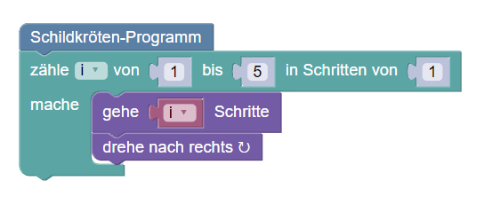
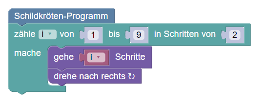
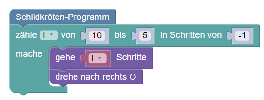
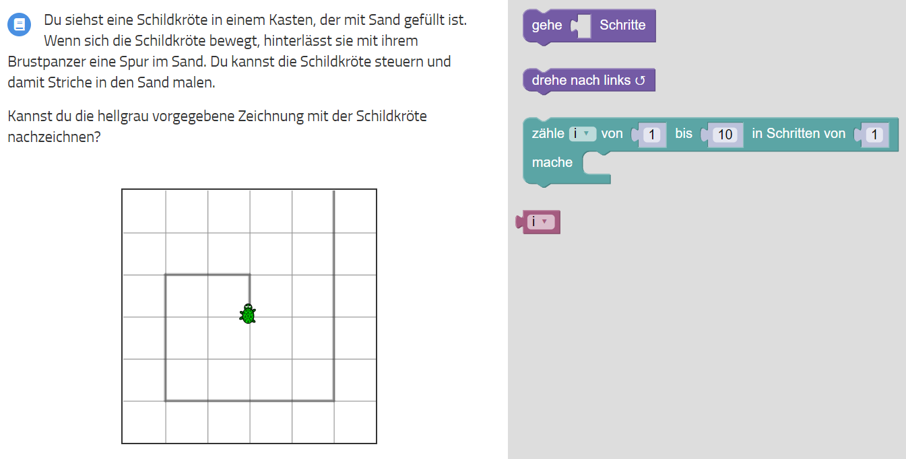
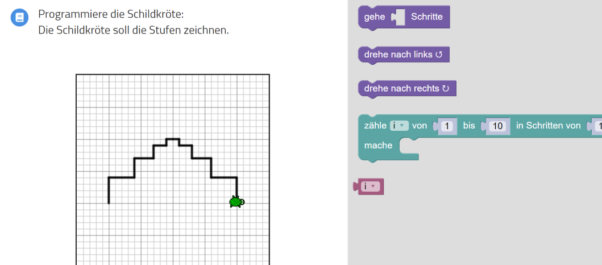
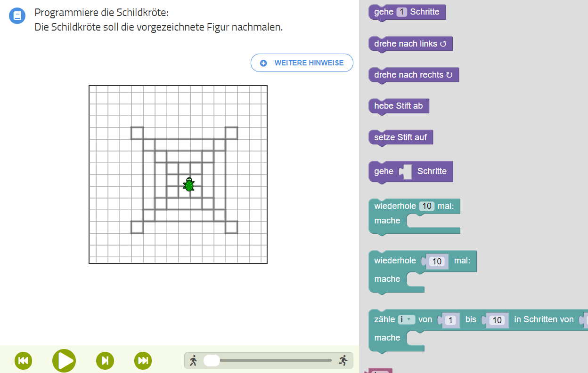

## Zähle-Schleifen

Bei den Zähle-Schleifen können wir die Schleifenvariable im Inneren
der Schleife verwenden.

Wir können auch größere Schritte machen oder die Schleifenvariable rückwärts laufen lassen.

---

Wenn sich ein Muster wiederholt und dabei seine Größe verändert, ist meist eine Zähle-Schleife im Spiel.

---

---

---

