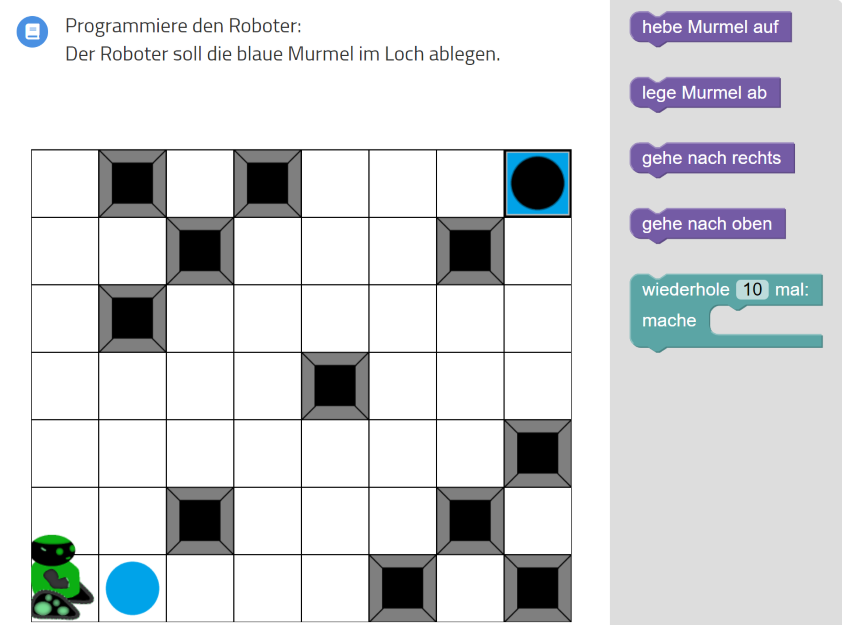
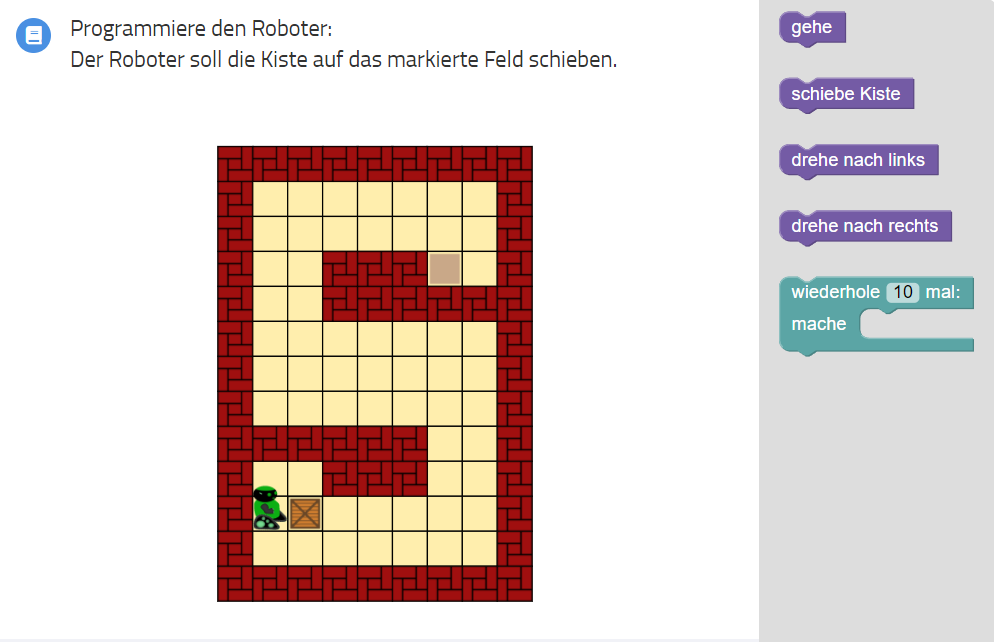
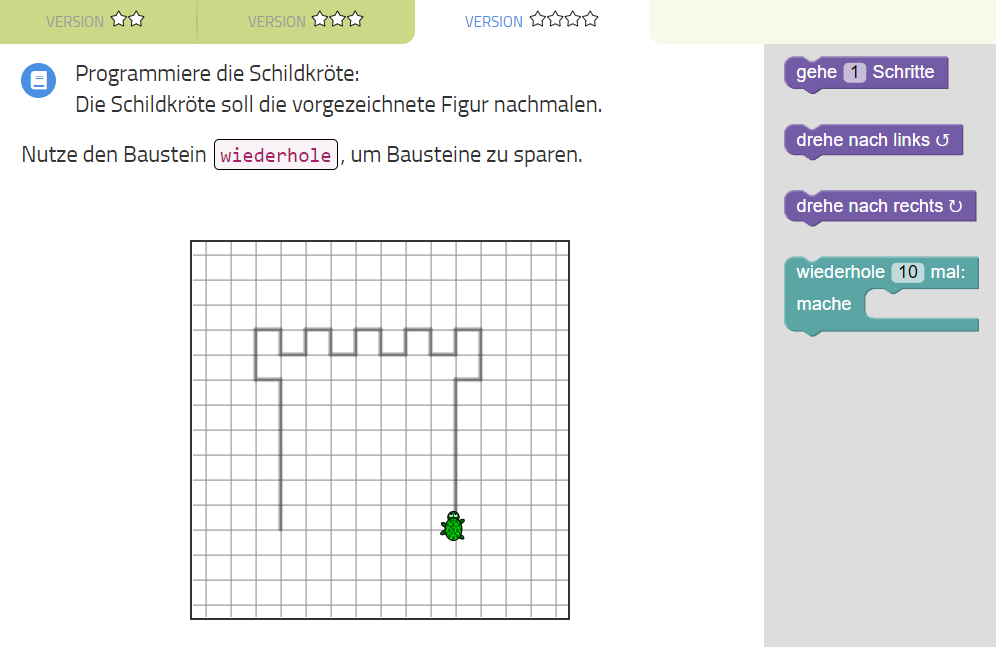

## Wiederholungen

Bei manchen Aufgaben müssen wir geeignete Muster finden, die wir wiederholen können, um mit
den verfügbaren Bausteinen die Aufgabe zu lösen.

Finde bei den folgenden Beispiele Muster, die zum Ziel führen.

---

---

---

