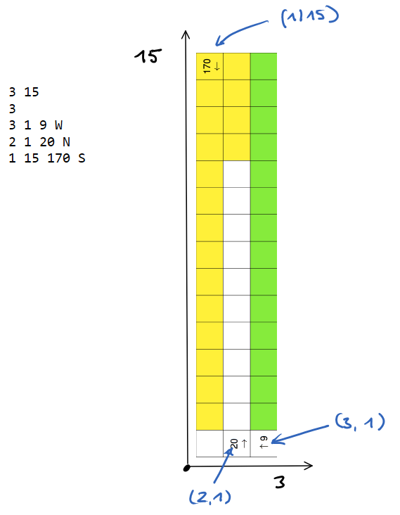

## Wintervorrat

36\. Bundeswettbewerb Informatik - Junioraufgabe 2

[Aufgabenstellung](wintervorrat.pdf) - [Beispieldaten](beispieldaten) -  [Lösungshinweise](wintervorrat_loesung.pdf) 

Interpretation der Beispieldaten:




#### Python

Der Ursprung in der Abbildung ist links unten und das erste Feld hat die Koordinaten (1/1) 
Die Koordinaten-Attribute für Vogel und Feld beginnen bei (0/0) und
der Ursprung liegt links oben. - Man kann dadurch sehr leicht Fehler machen und die Aufgabe wird eher schwierig.

```
(x/y) ist die x-te Zeile und y-te Spalte (bei 0 beginnend)
(0/0) ist oben links

```


```
class Vogel:
    def __init__(self,x,y,startzeit,richtung):
        self.x = x
        self.y = y
        self.richtung = richtung
        self.startzeit = startzeit
        
    def bewege(self):
        if self.richtung == 'S':
            self.x +=1
            if self.x == xmax-1:
                self.richtung = 'N'
        elif self.richtung == 'N':
            self.x -=1
            if self.x == 0:
                self.richtung = 'S'
        elif self.richtung == 'O':
            self.y +=1
            if self.y == ymax-1:
                self.richtung = 'W'
        elif self.richtung == 'W':
            self.y -=1
            if self.y == 0:
                self.richtung = 'O'
                    
    def __str__(self):
        return f'({self.x}/{self.y}) {self.richtung} {self.startzeit}'


class Feld:
    def __init__(self,x,y):
        self.x = x;
        self.y = y;
        self.absolutsicher = True
        self.sicher = False
        self.sichereMinuten = 0
        self.sichererStart = -1
        
    def __lt__(self, other):
        return (self.x,self.y) < (other.x,other.y)
        
    def __str__(self):
        return f'({self.x}/{self.y})-{self.sicher},{self.sichereMinuten},{self.sichererStart}'

nr = 1
f = open('./beispieldaten/wintervorrat'+str(nr)+'.txt')
ymax, xmax = [int(x) for x in f.readline().split()]
anzVoegel = int(f.readline())
voegel = []

for i in range(anzVoegel):
    y, x, t, r = f.readline().split()
    if r == "N": r = "S"                    # umdrehen da 0-Punkt oben links
    elif r == "S": r = "N"
    voegel.append(Vogel(int(x)-1, int(y)-1, int(t)-1, r))

felder = []

for x in range(xmax):
    for y in range(ymax):
        felder.append(Feld(x,y))
        
feldmap = {(F.x, F.y) : F for F in felder}   # Für Zugriff (x,y) -> Feld(x,y)


for t in range(0,720):
    
    '''
    t = 0 simuliert die Situation während der 1. Minute
    hat ein Vogel in der Eingabedatei den Startzeitpunkt 9, dann das
    dass er bei t = 8 zum ersten Mal mal ein Feld besetzt.
    '''
    for F in felder:
        F.sichereMinuten+=1
     
    for V in voegel:
        if V.startzeit <= t:
            F = feldmap[(V.x,V.y)]    # Felder, auf denen sich ein Vogel befindet sind nicht
            F.absolutsicher = False;  # mehr absolut sicher
            F.sichereMinuten = 0
            V.bewege()
            
    for F in felder:
        if F.sichereMinuten >= 30 and not F.sicher:
            F.sicher = True
            F.sichererStart = t-29
           
            
print('\nBeispiel Nr: ',nr)
print('--- absolut sichere Felder ---')        
absolutSicher = sorted([(F.y+1,F.x+1) for F in felder if F.absolutsicher])
print(absolutSicher)
print('Anzahl = ',len(absolutSicher))
print()

print('--- sichere Felder, (x, y, t) mindestens 30 Minuten sicher ab Minute t ----')
sicher = sorted([(F.y+1,F.x+1,F.sichererStart+1) for F in felder if F.sicher and not F.absolutsicher])
print(sicher)
print('Anzahl = ',len(sicher))
```

Ausgabe:

```
Beispiel Nr:  1
--- absolut sichere Felder ---
[(3, 2), (3, 3), (3, 4), (3, 5), (3, 6), (3, 7), (3, 8), (3, 9), (3, 10), (3, 11), (3, 12), (3, 13), (3, 14), (3, 15)]
Anzahl =  14

--- sichere Felder, (x, y, t) mindestens 30 Minuten sicher ab Minute t ----
[(1, 2, 1), (1, 3, 1), (1, 4, 1), (1, 5, 1), (1, 6, 1), (1, 7, 1), (1, 8, 1), (1, 9, 1), (1, 10, 1), (1, 11, 1), (1, 12, 1), (1, 13, 1), (1, 14, 1), (1, 15, 1), (2, 12, 1), (2, 13, 1), (2, 14, 1), (2, 15, 1)]
Anzahl =  18
```